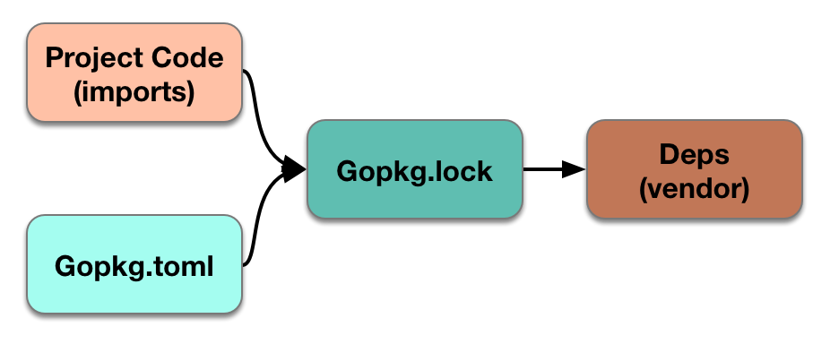

## dep 使用

### 获取
>go get -u github.com/golang/dep/cmd/dep

### 使用
>cd $PROJECTROOT
>
>dep init
>
>ls -al

发现多了Gopkg.lock、Gopkg.toml文件和vendor文件夹

例如，我在测试一个项目的时候，使用了
> github.com/bitly/go-simplejson
> 
> github.com/axgle/mahonia

两个第三方包，执行过dep init之后，在vendor目录如下

并且新增了两个文件，分别为Gopkg.lock、Gopkg.toml
内容为 
Gopkg.lock

 Gopkg.toml

 它们彼此关系为

 所以我们可以为项目指定Gopkg.toml内容 

	# Gopkg.toml example
	#
	# Refer to https://golang.github.io/dep/docs/Gopkg.toml.html
	# for detailed Gopkg.toml documentation.
	#
	# required = ["github.com/user/thing/cmd/thing"]
	# ignored = ["github.com/user/project/pkgX", "bitbucket.org/user/project/pkgA/pkgY"]
	#
	# [[constraint]]
	#   name = "github.com/user/project"
	#   version = "1.0.0"
	#
	# [[constraint]]
	#   name = "github.com/user/project2"
	#   branch = "dev"
	#   source = "github.com/myfork/project2"
	#
	# [[override]]
	#   name = "github.com/x/y"
	#   version = "2.4.0"
	#
	# [prune]
	#   non-go = false
	#   go-tests = true
	#   unused-packages = true
							
	
	[[constraint]]
	  branch = "master"
	  name = "github.com/axgle/mahonia"
	
	[[constraint]]
	  name = "github.com/bitly/go-simplejson"
	  version = "0.5.0"
	
	[prune]
	  go-tests = true
	  unused-packages = true

如果自己已经写好toml文件，执行
>dep ensure

即可完成指定toml包的导入，也可动态添加包到项目
>1、修改toml文件，然后dep ensure
>
>2、dep ensure -add github.com/bitly/go-simplejson@=0.4.3命令导入包

如果没有toml文件执行dep init即可执行包的导入功能，可查看详细信息
>dep init -gopath -v

输出为：

	Getting direct dependencies...
	Checked 4 directories for packages.
	Found 2 direct dependencies.
	Searching GOPATH for projects...
	  Using master as constraint for direct dep github.com/axgle/mahonia
	  Locking in master (0c44128) for direct dep github.com/axgle/mahonia
	
	The following dependencies were not found in GOPATH:
	  github.com/bitly/go-simplejson
	
	The most recent version of these projects will be used.
	
	Root project is "giter.org/duoxieyun/sliceGoTest"
	 4 transitively valid internal packages
	 2 external packages imported from 2 projects
	(0)   ✓ select (root)
	(1)	? attempt github.com/axgle/mahonia with 1 pkgs; at least 1 versions to try
	(1)	    try github.com/axgle/mahonia@master
	(1)	✓ select github.com/axgle/mahonia@master w/1 pkgs
	(2)	? attempt github.com/bitly/go-simplejson with 1 pkgs; 5 versions to try
	(2)	    try github.com/bitly/go-simplejson@v0.5.0
	(2)	✓ select github.com/bitly/go-simplejson@v0.5.0 w/1 pkgs
	  ✓ found solution with 2 packages from 2 projects
	
	Solver wall times by segment:
	              b-gmal: 400.713885ms
	         b-list-pkgs: 366.372825ms
	         select-atom:    151.073µs
	             satisfy:    144.554µs
	         select-root:    126.376µs
	            new-atom:    120.487µs
	               other:     47.406µs
	     b-list-versions:     27.123µs
	  b-deduce-proj-root:       3.88µs
	     b-source-exists:      3.634µs
	
	  TOTAL: 767.711243ms
	
	  Using ^0.5.0 as constraint for direct dep github.com/bitly/go-simplejson
	  Locking in v0.5.0 (aabad6e) for direct dep github.com/bitly/go-simplejson
	(1/2) Wrote github.com/bitly/go-simplejson@v0.5.0
	(2/2) Wrote github.com/axgle/mahonia@master

然后查看文件目录PROJECT 

执行dep导入包动作，其实dep首先把包保存在 $GOPATH/pkg/dep/...中保存一份，下次导入的时候，如果指定 -gopath会优先从 $GOPATH/pkg/dep/...中搜索，然后在从互联网中下载
此时$GOPATH/pkg/dep文件目录如下：

###其他

>dep ensure -update    //更新toml